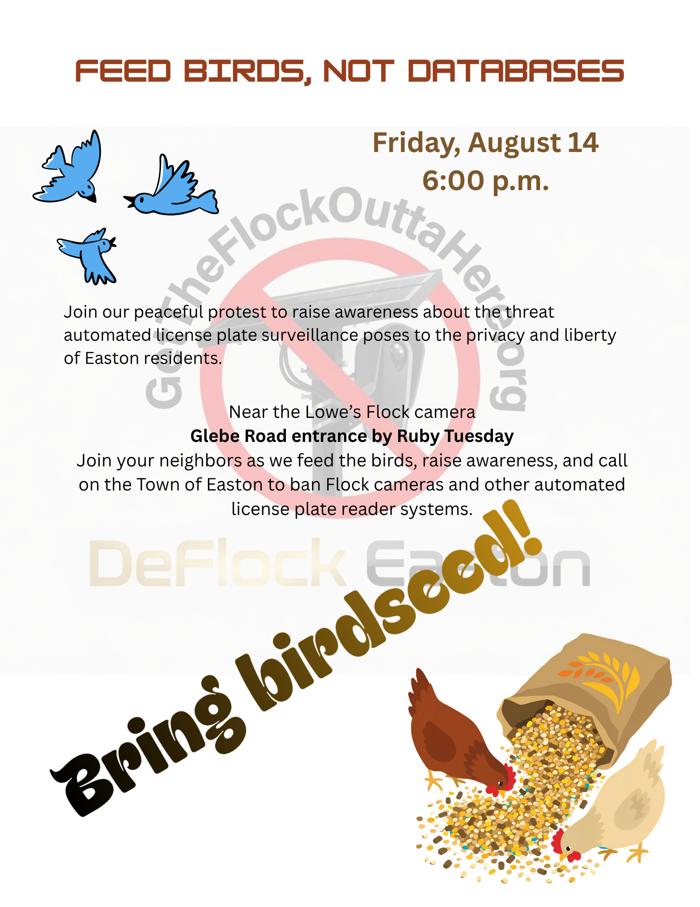

**Friday, August 14 at 6:00 p.m.**
**Lowe's, Glebe Road entrance near Ruby Tuesday, Easton, Maryland**

Join us for a peaceful public demonstration against automated license plate surveillance in Easton.

We are calling it **Feed Birds, Not Databases**.

Instead of interfering with a Flock camera, we are going to do something much more useful: gather nearby, feed actual birds, talk with our neighbors, and raise awareness about what automated license plate readers are doing in our community.

## Why are we doing this?

Flock cameras do more than take pictures.

Automated license plate reader systems are designed to identify vehicles, record when and where they were seen, and make that information searchable. When these systems are networked together, they can create a detailed record of a person's movements over time without any requirement that the person be suspected of a crime.

That kind of surveillance deserves public discussion before it becomes a permanent part of everyday life in Easton.

We believe the people who live here should decide whether that infrastructure belongs in our community.

## Why feed birds?

Because birds are real. And unlike Flock, they’re not building a database about you.

Flock calls its surveillance network a "flock."

We prefer the real thing.

So we will bring some birdseed, gather peacefully near the camera, and use the occasion to start conversations about privacy, liberty, public accountability, and the future of surveillance in Easton.

**Feed birds. Not databases.**

## What to bring

Bring yourself, a friend, a sign if you would like one, and a small amount of birdseed.

Most importantly, bring your questions.

You do not need to already agree with us. If you support Flock cameras, oppose them, or simply want to understand what the debate is about, come talk with us.

## Please keep it peaceful

This is a peaceful demonstration and public-awareness event.

Do not touch, cover, climb on, obstruct, disable, damage, or otherwise interfere with any camera, pole, wiring, equipment, vehicle, or private property.

Please remain safely out of traffic and respect lawful instructions from property owners and public officials.

Our purpose is to challenge surveillance through speech, public participation, and civic action.

## What are we asking for?

We are asking the Town of Easton to prohibit the use of Flock cameras and other automated license plate reader systems within the Town.

The issue is larger than one camera or one company.

The question is whether people going about their daily lives should routinely have their movements recorded, indexed, and made searchable simply because the technology exists to do it.

We believe Easton can choose another path.

## Join us

**Feed Birds, Not Databases**
Friday, August 14
6:00 p.m.

**Lowe's**
Glebe Road entrance near Ruby Tuesday
Easton, Maryland

Come feed the birds.

Come meet your neighbors.

Come ask questions.

And help us keep Easton a community where surveillance is the exception, not the default.
