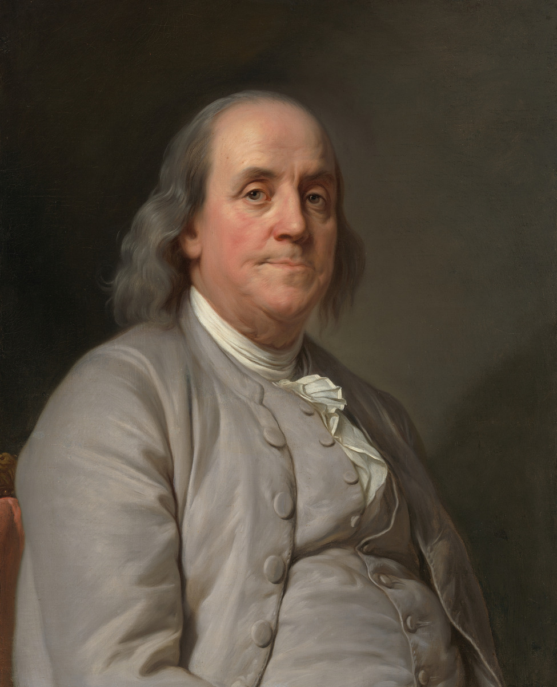

<figure class="page-hero">
  
</figure>

<blockquote class="hero-quote">
  
“Those who would give up essential Liberty, to purchase a little temporary Safety, deserve neither Liberty nor Safety.”

  <footer>Benjamin Franklin, 1755</footer>
</blockquote>

# We Did Not Inherit Liberty So Easton Could Build a Surveillance Network

In 2026, Americans are celebrating 250 years since the Declaration of Independence announced that government exists to secure the rights of the people and derives its legitimate power from their consent.

At the same time, Easton is allowing privately operated surveillance cameras to identify vehicles, record their movements, collect associated data, and preserve that information for later government use.

The cameras do not begin with suspicion.

They begin with everyone.

That is not a narrow investigation of a crime. It is the construction of a permanent surveillance capability over an entire community.

The Founding generation would have recognized the danger immediately.

They had lived under a government that claimed broad powers to search first and discover wrongdoing afterward. They rejected general warrants and writs of assistance because no free people should be forced to live under indiscriminate government inspection.

Today’s technology is more efficient, more persistent, and more powerful than anything British officials possessed.

But efficiency does not transform arbitrary power into legitimate power.

**A digital general warrant is still a general warrant.**

## Government Must Suspect Someone Before Investigating Them

Automatic license plate reader surveillance reverses the proper order of law enforcement.

It records everyone first, stores the information, and permits searches later.

The surveillance is not directed at a particular suspect, vehicle, place, or offense. The system collects information about the population so that the government may later determine who interests it.

That is the governing mentality behind a general warrant.

Under a free system, the government develops evidence, identifies a suspect, and seeks lawful authority to investigate.

Under a surveillance system, the government collects information about everyone and waits for a reason to use it.

Those are not the same thing.

## Being Visible in Public Is Not Consent to Government Tracking

A person standing beside the road may see one car pass at one moment.

A surveillance network can identify that vehicle, record the time and location, connect observations from multiple locations, search previous movements, and preserve a history for later examination.

Ordinary observation is temporary and limited.

Automated surveillance is systematic, persistent, searchable, and scalable.

Being seen in public is not the same as consenting to government tracking.

Driving on a public street does not mean the government should be allowed to identify you, record where you went, build a searchable history of your movements, and store that information in case it becomes useful later.

The difference is not merely where the observation occurs.

The difference is the systematic identification, accumulation, retention, and searchability of information about people who are not suspected of any crime.

## Public Safety Does Not Erase Constitutional Limits

Every expansion of government power can be defended by naming a frightening crime it might help solve.

That cannot be the constitutional test.

General warrants could find criminals.

Warrantless house-to-house searches could uncover contraband.

Opening every letter could reveal conspiracies.

Tracking every telephone could produce evidence.

The American answer has never been that useful powers are therefore rightful powers.

Government must pursue public safety within limits because a government permitted to investigate everyone eventually decides that anyone may be investigated.

The question is not whether surveillance sometimes produces useful information.

Of course it does.

The question is whether usefulness alone gives the government the right to collect information about everyone.

It does not.

## Private Ownership Does Not Make Government Surveillance Private

Easton cannot escape responsibility merely because a corporation owns the cameras, operates the network, or stores the records.

When equipment is installed for law-enforcement use, data is made searchable by government officials, and public authority benefits from the resulting surveillance, the constitutional concern does not disappear.

Government should not be able to obtain indirectly what it would be forbidden, unable, or unwilling to construct openly.

Outsourcing the machinery does not privatize the exercise of power.

A privately owned camera can still serve a public surveillance system.

A corporate database can still become a government investigative tool.

A contract does not erase the public’s right to object.

## Temporary Promises Create Permanent Infrastructure

The cameras will always be defended with exceptional examples.

A stolen car.

A missing child.

A violent suspect.

But Easton is not being asked to approve a camera that activates only during those emergencies.

It is being asked to accept a system that records the innocent continuously so that their information might become useful later.

The promise is temporary safety.

The purchase price is permanent surveillance.

Franklin’s warning was not that safety is unimportant. It was that essential liberty should not be surrendered for a limited promise of protection.

A town that builds permanent surveillance infrastructure in response to temporary fears has made exactly that bargain.

# The Revolution Was Not Fought for More Efficient Government Surveillance

The Declaration of Independence was not a complaint that British government was insufficiently effective.

It was an indictment of power exercised without proper limits, accountability, or consent.

The Revolution rejected the idea that officials may claim whatever authority they consider useful and require the people to trust that it will be used responsibly.

The Constitution did not reverse that principle. It attempted to place it into a durable structure.

The Bill of Rights made the limits more explicit.

The Fourth Amendment does not instruct government to search efficiently. It recognizes the right of the people to be secure and requires particularized justification before government intrudes.

That distinction is the dividing line between policing and mass surveillance.

**Police investigate crimes.**

**A surveillance state records populations.**

## “But These Cameras Make Us Safer”

Perhaps they sometimes help police locate a wanted vehicle.

That does not settle the question.

The issue is not whether surveillance can produce useful information. The issue is whether government should routinely collect information about every innocent person in order to obtain it.

Freedom would be easy to preserve if intrusive powers never worked.

Constitutional limits exist because intrusive powers often do work, and because effectiveness alone cannot determine what government is permitted to do.

The proper question is not:

> Can Easton find a use for this information?

It is:

> By what right does Easton collect information about people who are not suspected of any crime?

Until that question is answered, claims about usefulness are beside the point.

## Trust Is Not a Safeguard

Supporters of surveillance frequently answer concerns by assuring the public that officials will use the system responsibly.

That is not enough.

The American system was not designed around the assumption that government officials will always be wise, restrained, honest, and benevolent.

It was designed around enforceable limits.

Policies can change.

Administrations can change.

Vendors can change.

Database access can expand.

Retention periods can be lengthened.

Information collected for one purpose can be used for another.

A system that depends entirely on permanent good judgment is not a protected system.

It is an invitation to abuse.

## Innocence Should Not Require an Explanation

A person should not have to explain why he drove through town, visited a doctor, attended a political meeting, entered a church parking lot, met with an attorney, stayed at a hotel, or spent time at another person’s home.

The government should first have a lawful reason to investigate.

The citizen should not first have to prove that his movements were innocent.

Mass surveillance changes the relationship between government and the public.

It treats ordinary movement as data to be collected.

It treats privacy as suspicious.

It treats the absence of evidence as a reason to gather more information.

That is incompatible with the presumption of innocence.

# Easton Must Choose

Easton received its official beginning under colonial government in 1710.

In 1788, the same year Maryland ratified the United States Constitution, the town was renamed Easton.

Our local government has existed on both sides of the American rejection of arbitrary government power.

It should understand better than most that liberty is not preserved through commemorations, flags, speeches, or anniversary celebrations.

Liberty is preserved when government is offered a useful power and nevertheless refuses it because the power is incompatible with a free society.

Easton should not celebrate America’s founding while constructing the kind of indiscriminate surveillance authority its founding principles condemn.

**Remove the cameras.**

**Reject future deployments.**

**Pass an ordinance banning automatic license plate reader surveillance in Easton.**

That is how a town honors 250 years of American liberty.

---

## Take Action

Easton’s elected officials need to hear directly from the people they represent.

Attend the next Town Council meeting.

Contact the mayor and members of the Town Council.

Tell them that public safety does not require the mass collection of innocent people’s movements.

Tell them to remove the existing cameras and pass an ordinance banning automatic license plate reader surveillance in Easton.
