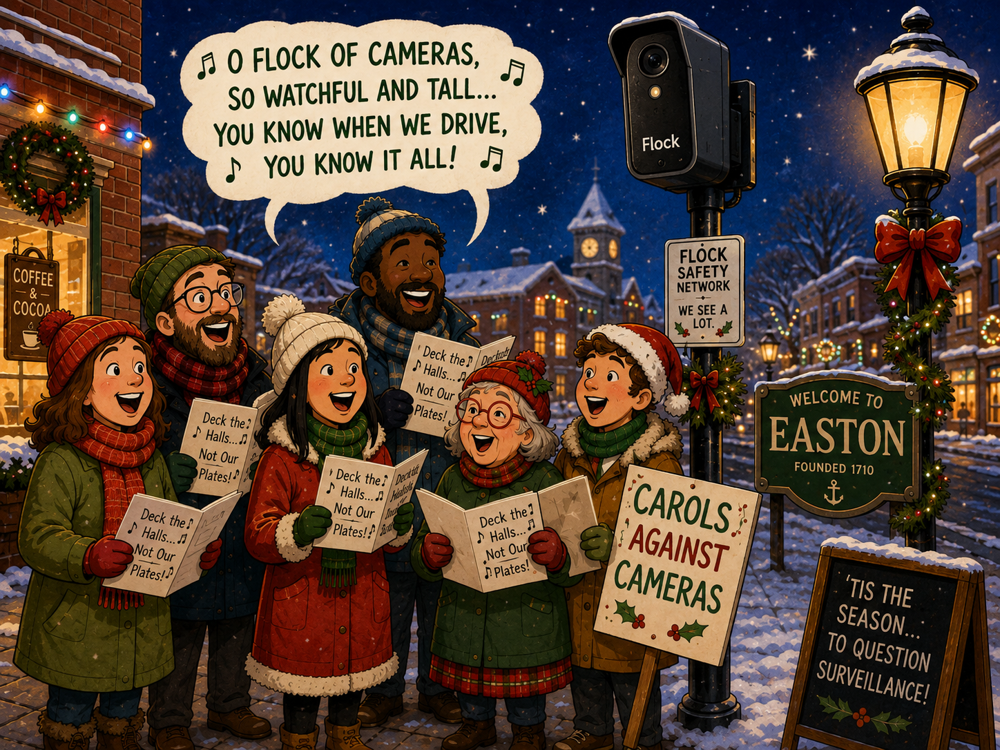

#+title: Christmas in August
#+date: 2026-08-09
#+draft: false
#+slug: christmas-in-august
#+tags:
#+images: /updates/christmas-in-august/the-flock-off-choir.png
#+description:
#+summary: The Flock Off Choir
#+hide_summary: true
* Feed birds, not databases Flock Off Choir
Come join the unoffical "Flock Off Choir" this Friday, August 14th at 6PM to sing caroles about anti-surveillance.
*

* Carols Against Cameras: A Flock-Free Songbook

A collection of Christmas carols for people who believe you should be able to drive through your own town without being entered into a searchable surveillance database.

[[./Carols_Against_Cameras_A_Flock_Free_Songbook.pdf][Download your copy here]]

** Oh Little Town of Easton
/To the tune of “O Little Town of Bethlehem”/

#+begin_verse
Oh little town of Easton,
How still we see thee lie,
While cameras read every plate
Of every passerby.
The streets may seem so peaceful,
The traffic rolling through,
But somewhere in a database
They’re keeping track of you.

Oh Flock upon the roadside,
With lenses pointed down,
Who gave you leave to catalogue
The people of our town?
No warrant and no reason,
No crime we need commit,
Our movements stored and searchable,
And we object to it.

We cherish law and safety,
We cherish neighbors too,
But liberty means government
Has limits it must rue.
A free and peaceful people
Should travel without fear,
That every trip and every stop
Be logged from year to year.

So hear us, Town of Easton,
Before these systems grow,
Before surveillance takes its root
And becomes hard to throw.
No databases watching,
No dragnet in our town,
Get the Flock out of Easton,
And take those cameras down!
#+end_verse

** Flock the Halls
/To the tune of “Deck the Halls”/

#+begin_verse
Flock the halls with surveillance cameras,
Fa la la la la, la la la la.
Track the cars of moms and grandmas,
Fa la la la la, la la la la.
Scan the plates of every driver,
Fa la la, la la la, la la la.
Store the records on a server,
Fa la la la la, la la la la.

See the camera by the roadway,
Fa la la la la, la la la la.
Watching everyone who goes by,
Fa la la la la, la la la la.
No suspicion, no citation,
Fa la la, la la la, la la la.
Just a town-wide observation,
Fa la la la la, la la la la.

Raise your voice for Constitution,
Fa la la la la, la la la la.
Privacy is our solution,
Fa la la la la, la la la la.
Tell the Council, tell the Mayor,
Fa la la, la la la, la la la.
Easton needs no roadside stare,
Fa la la la la, la la la la.
#+end_verse

** Silent Night, Surveillance Night
/To the tune of “Silent Night”/

#+begin_verse
Silent night, surveillance night,
Cameras scan left and right.
Every plate on the avenue,
Logged in a system as cars pass through.
Travel should not be tracked.
Travel should not be tracked.

Silent night, database bright,
Search our movements day and night.
Where we traveled, when and where,
Who was nearby and who was there.
That is too much power.
That is too much power.

Silent night, freedom's light,
Keep the Fourth Amendment bright.
Safety need not mean a state
Watching everyone at every gate.
Let Easton remain free.
Let Easton remain free.
#+end_verse

** God Rest Ye Merry, Privacy
/To the tune of “God Rest Ye Merry, Gentlemen”/

#+begin_verse
God rest ye merry, privacy,
Let nothing you dismay,
For cameras should not catalogue
Each driver every day.
No citizen should need a cause
To freely make their way.

O tidings of freedom and joy,
Freedom and joy,
O tidings of freedom and joy.

From every road in Easton town
The people come and go,
To work, to shop, to visit friends,
As free people should do so.
Their movements need not feed a net
That watches where they go.

O tidings of freedom and joy,
Freedom and joy,
O tidings of freedom and joy.

So tell our Town officials now
Before the cameras spread,
A free society should not build
A map of where we've tread.
Protect the rights of everyone
And pull the plug instead.

O tidings of freedom and joy,
Freedom and joy,
O tidings of freedom and joy.
#+end_verse

** We Wish You a Flock-Free Christmas
/To the tune of “We Wish You a Merry Christmas”/

#+begin_verse
We wish you a Flock-free Christmas,
We wish you a Flock-free Christmas,
We wish you a Flock-free Christmas,
And a private New Year!

No tracking we bring
To you and your kin,
We wish you a Flock-free Christmas
And a private New Year!

Please take down the roadside cameras,
Please take down the roadside cameras,
Please take down the roadside cameras,
And give us good cheer!

No tracking we bring
To you and your kin,
We wish you a Flock-free Christmas
And a private New Year!

We won't go until they're gone now,
We won't go until they're gone now,
We won't go until they're gone now,
So hear us right here!

No tracking we bring
To you and your kin,
We wish you a Flock-free Christmas
And a private New Year!
#+end_verse

** Away with the Cameras
/To the tune of “Away in a Manger”/

#+begin_verse
Away with the cameras,
No lens by the road,
No database building
Where travelers have rode.
The cars through our Easton
Should freely pass by,
Without being entered
For future AI.

The police have a mission,
And we honor it still,
But powers need limits,
As free people will.
Investigate suspects
When evidence is found,
But don't turn the whole town
To surveillance ground.

So guard our Fourth Amendment,
And liberty too,
For power once given
Is hard to undo.
Let Easton choose freedom,
Let privacy abound,
Away with the cameras,
And take Flock systems down.
#+end_verse
