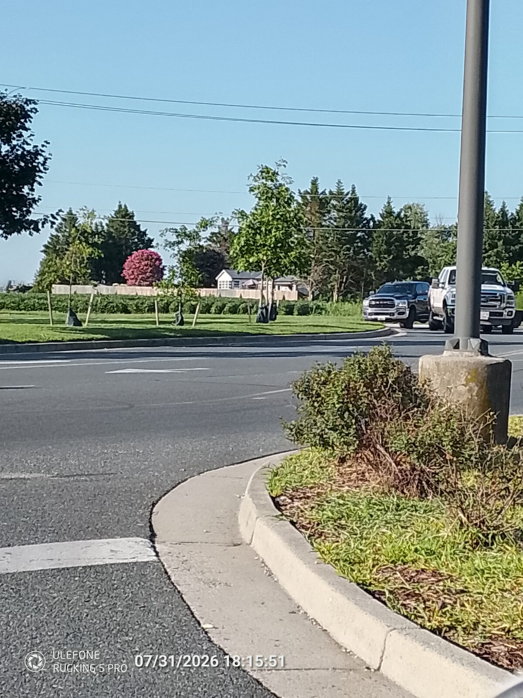
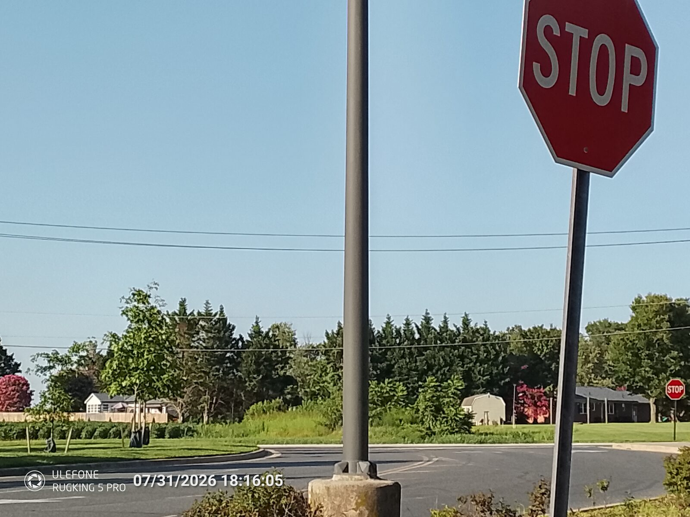
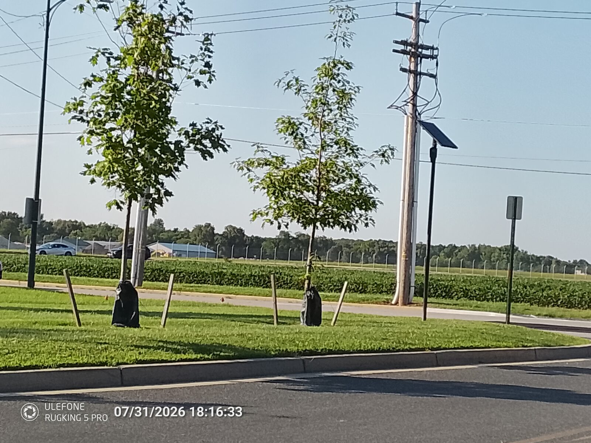
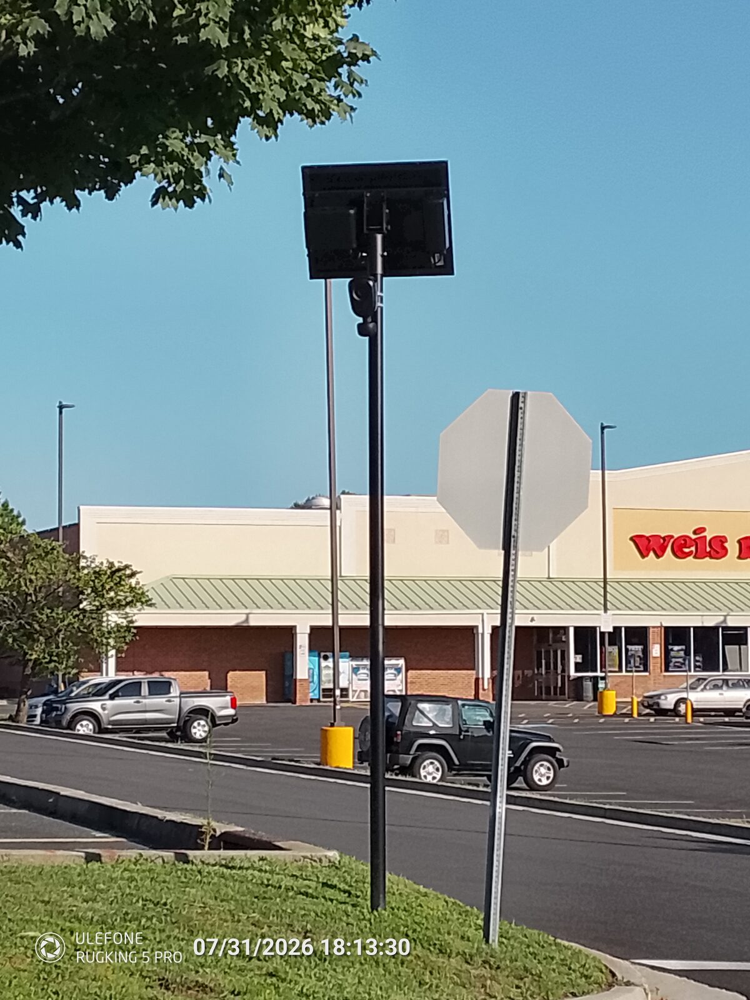
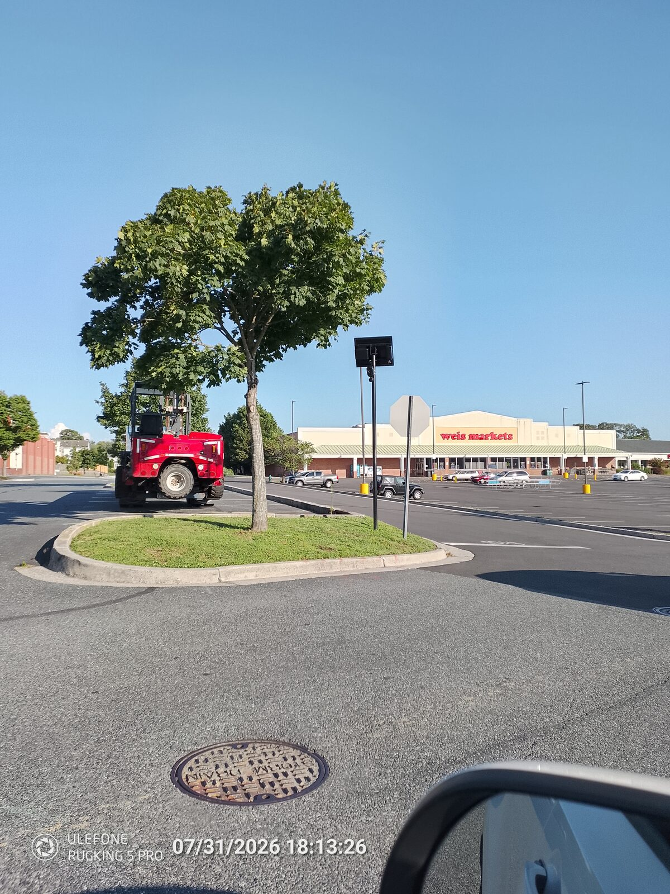
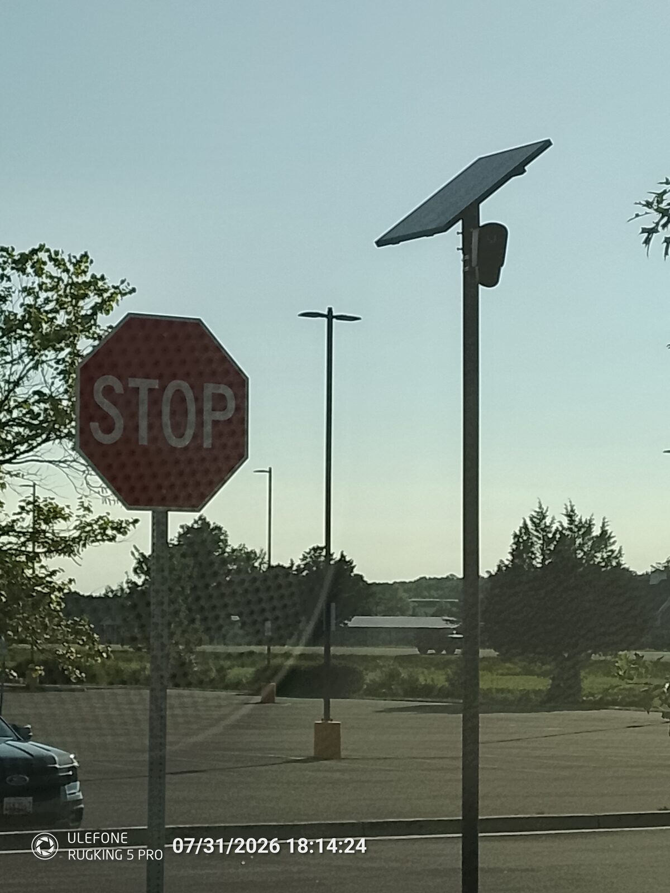

Many years ago, I heard a retired Army colonel say, "You can tell the difference between a prison and a warehouse by the way the barbed wire leans. If it leans out, it's to keep people out. If it leans in, it's to keep people in."

That made sense to me then, and it still does now.

So, when I took a ride over to Lowe's today to make a [video](https://youtu.be/Wo1MlKAfFqo?si=l1m82nklxKaHxXY9) about keeping things civil when engaging our elected officials, because they are our friends and neighbors and the surveillance state affects them too, I noticed something curious about the cameras.

Only one camera was pointed toward the parking lot.

This is the camera at Glebe Road as you enter the thoroughfare leading to Lowe's parking lot. Let me write that again: _entering the thoroughfare_, **NOT THE PARKING LOT**.

If you are going to McDonald's and enter from Glebe Road, you get read. If you are going to Hair O' the Dog and enter from Glebe, you get read. If you enter from Glebe to get to Kohl's, **YOU GET READ, RECORDED, AND IDENTIFIED.**

I took this picture near the mulch and swing sets by the Garden Center. Notice anything odd?

That expensive Flock Safety camera, which we are told is there to stop people from stealing from Lowe's, is oddly hidden behind a newly planted tree. The tree obstructs its view of the very thing we are told Lowe's needs watched.

A better picture of the lone sentry protecting Lowe's from crime.

Make it make sense.

But surely the cameras on the other side, near Wise, **MUST HAVE A BETTER LINE OF SIGHT**, right?

Oh, look. That's not aimed at Lowe's parking lot. It is conveniently positioned to track you.

A better look at the tattletale.

Finally, we get one that is looking inward. But oddly enough, even this camera appears positioned primarily for a line of sight along the road, not toward the merchandise it is supposedly there to protect.

The line of sight tells the story.

These cameras do not appear to be arranged mainly to watch Lowe's property. They appear to be arranged to identify vehicles moving into, out of, and through the entire shopping area.

Maybe that is merely a coincidence.

Maybe.
