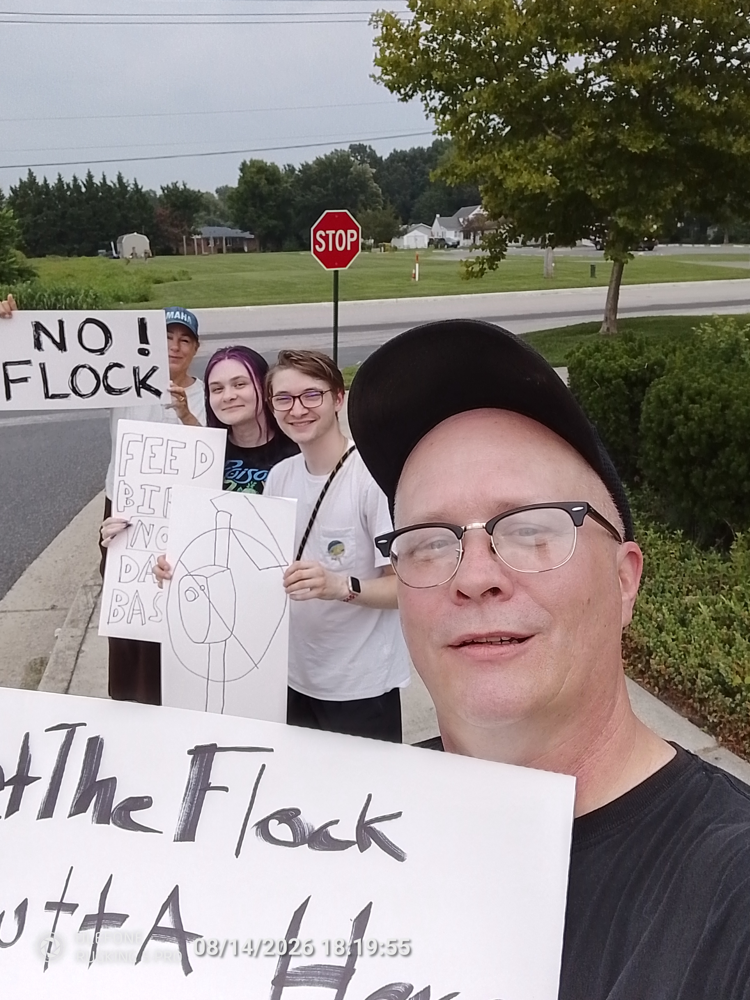
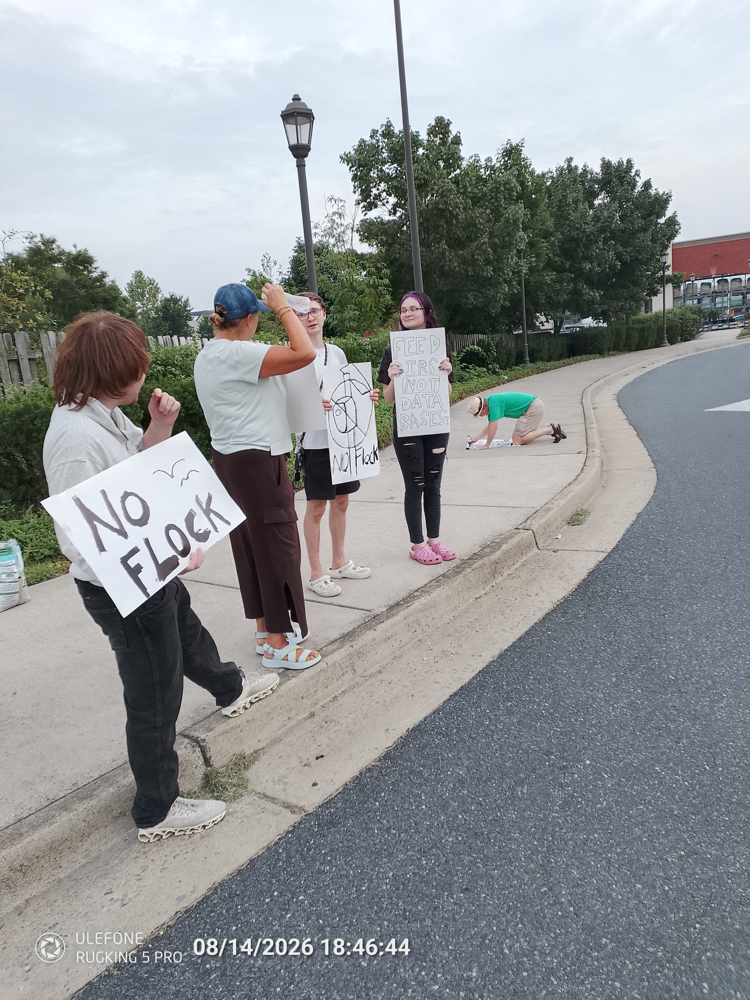
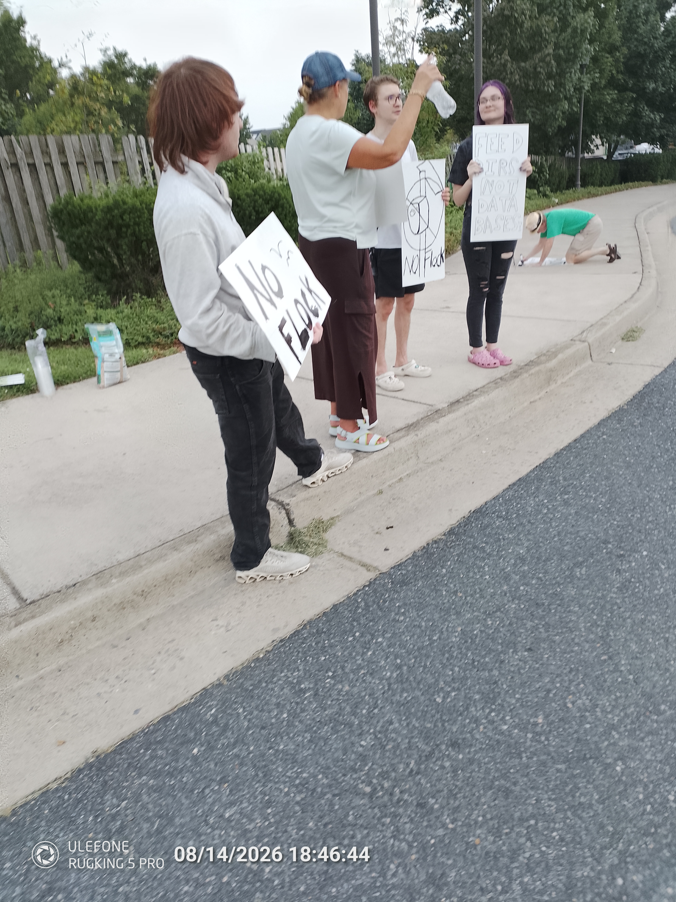

#+title: Feed Birds, Not Databases Rally Draws Positive Response from Easton Motorists
#+date: 2026-08-15
#+draft: false
#+slug: feed-birds-not-databases-rally
#+tags: ALPR Flock-Safety Easton-Maryland Surveillance Privacy Feed-Birds-Not-Databases
#+description: Residents gathered in Easton for the first Feed Birds, Not Databases rally to oppose Flock Safety cameras and automated license plate reader surveillance.
#+summary: Residents spent about 90 minutes protesting Flock Safety cameras in Easton, while passing motorists responded overwhelmingly positively to the Feed Birds, Not Databases rally.

A small gathering of Easton-area residents came together Friday evening for the first *Feed Birds, Not Databases* rally, exercising an old American tradition: publicly questioning the power of government.



The group gathered near the Flock Safety camera at Glebe Road and the Ruby Tuesday entrance, calling for an end to automated license plate reader surveillance in Easton.

Demonstrators spent approximately an hour and a half along the roadway holding signs, talking with motorists, and drawing attention to the collection, storage, and sharing of vehicle-location data involving people who have not been accused or suspected of a crime.

One motorist stopped to offer his support, telling demonstrators:

#+begin_quote
We are being watched everywhere. It's like we are in China. I don't live in China.
#+end_quote

Demonstrator Brian questioned why the surveillance is necessary in the first place.

#+begin_quote
I just don't understand why they need to watch us. The whole thing makes no sense.
#+end_quote

Dr. James Kelly and his son Ryan also attended the rally to voice their skepticism of the Flock cameras.

Ryan, who is preparing for law school, said:

#+begin_quote
The Founding Fathers are rolling over in their graves over just how intrusive this government has become. John Adams said that only a moral and just people could sustain the Constitution. It is clear we are far from having a moral people running our government.
#+end_quote

St. Michaels resident Laurie attended to show her support for the effort. When asked why she was concerned about Flock Safety cameras, she said:

#+begin_quote
These are more than just cameras. It is AI that watches your every move and builds a dossier on innocent people who have not been accused or even suspected of a crime. We have already seen examples of people being falsely accused and charged because these systems got it wrong. I'm concerned that this creates a "guilty until proven innocent" situation, where innocent people can be put through traumatic and costly experiences just trying to prove they did nothing wrong. That is antithetical to our justice system.
#+end_quote

Organizer Norman Bauer said the reaction from passing motorists was one of the most striking parts of the evening.

#+begin_quote
It was hot, humid, and the gnats and mosquitoes were out in force, but we stayed out there for about an hour and a half. What really struck me was the response from motorists. I've been to plenty of sign waves and rallies, and this was the first one where not a single person swore at us or flipped us the bird. Nearly every motorist who interacted with us was positive. Those who weren't interested simply drove by. I was genuinely surprised by how positive the response was.
#+end_quote

The rally was part of the local effort to prohibit the use of Flock Safety and other automated license plate reader systems in Easton.

Our objection is not to ordinary security cameras. It is to systems that systematically collect, store, search, and share information about the movements of people who have not been accused or suspected of a crime.

We have proposed an ordinance that would prohibit the operation and use of automated license plate reader systems in Easton and restrict Town officials and employees from accessing ALPR-derived data through outside vendors, neighboring jurisdictions, private entities, or shared databases.

Friday evening's message was intentionally simple:

*Feed birds, not databases.*

* Resources

- [[./early-arrivals.mp4][Video: Early arrivals]]
- [[./getheflockouttahere-seed-toss.mp4][Video: Seed toss]]
- 
- 
- 
