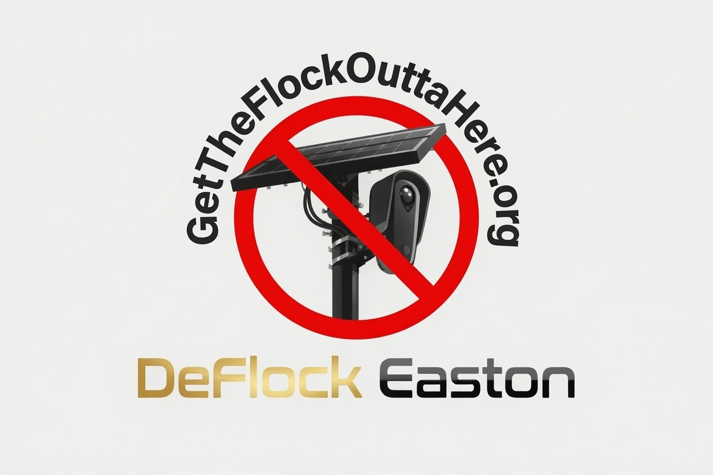

First, I want to thank everyone for their support and generosity. It has restored my faith in the American tradition. 

George Mason wrote of “the enjoyment of life and liberty, with the means of acquiring and possessing property, and pursuing and obtaining happiness and safety” in the Virginia Declaration of Rights. Thomas Jefferson would soon distill that idea into perhaps the most famous words in American political history: “Life, Liberty and the pursuit of Happiness.”

And that is what we are honoring here. Ordinary people resisting and shaping the direction of government. 

If ever there were a summary of the American ethos, those words express it.

I am humbled that so many of you are as concerned as I am about how far we are moving away from that ethos and toward something very different. A society in which ordinary people are increasingly watched, recorded, catalogued, and treated as subjects to be monitored rather than free people left to pursue their own lives.

That is anathema to life, liberty, and the pursuit of happiness. 

# Yard Signs

One of the easiest ways to show your support is to make a sign.

It does not have to be professionally printed. It does not have to be perfect. Cardboard, poster board, paint, markers, whatever you have on hand will work.

The important thing is to be seen.

Every homemade sign in a yard, at a rally, or carried into a Town Council meeting tells our decision makers that opposition to automated surveillance in Easton is real, visible, and growing.

Here is one I made myself:



If you would rather put a professionally printed sign in your yard, or help us get more of them into the community, we now have a way to do that too.

The decision makers in Town are very aware of the controversy, and I believe they want to do the right thing. What helps them do that is seeing, clearly and publicly, where the community stands.

To make that easier, I have worked out an agreement with [Chesapeake Custom Print & Ship](https://chesapeakeprint.com/) to produce full-color yard signs, complete with H-frames, at a substantial discount.

And because DeFlock Easton is an all-volunteer campaign that does not accept monetary donations, we have structured it a little differently.

# Here's How It Works

You do not donate money to DeFlock Easton.

Instead, you purchase a batch of yard signs directly from Chesapeake Custom Print & Ship. They print the signs, and the finished signs are donated to the campaign for distribution.

The money never passes through us.

You buy the signs and we put them to work.

# Yard Sign Pricing

The standard signs are:

**24" × 18"**

Full color

Double sided

4 mm corrugated plastic - _Stakes included_

Signs are ordered in *batches of 10.*

*10 double-sided yard signs: $281.94*

That price _already includes the **40% discount** Chesapeake Custom Print & Ship_ has generously extended to campaign supporters.

We are grateful to Peter, Emily, and everyone at Chesapeake Custom Print & Ship for working with us to make these signs more affordable. They are a local Easton business, so if you have printing or shipping needs of your own, please consider supporting the people who are supporting us.

**Chesapeake Custom Print & Ship**

101 Marlboro Ave, Suite 11, Easton, MD 21601

Phone: (410) 819-0246

Fax: (410) 819-0136

info@chesapeakeprint.com

**Store Hours:**

Monday–Friday: 8:00am-6:00pm

Saturday: 9:00am-1:00pm

Sunday: Closed

Below is the double-sided sign your donation will help put around Easton.

Thank you again for supporting this mission, whether that means making your own sign, putting one in your yard, speaking at a Town Council meeting, sharing our work, or donating a batch of signs.

Every little bit helps make opposition to mass surveillance in Easton visible.

Now **get the flock outta here!**
